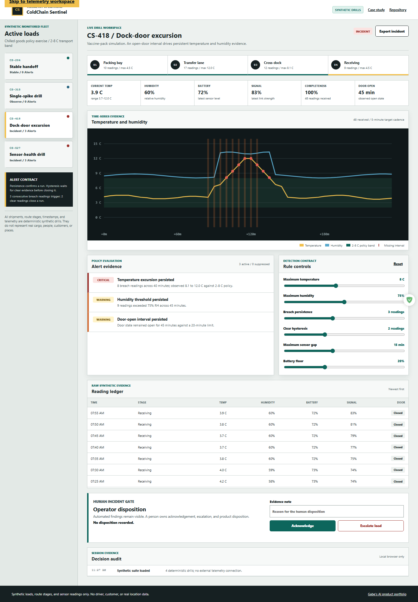

# ColdChain Sentinel

ColdChain Sentinel is a static telemetry incident console for exploring how transparent anomaly rules can support cold-chain operations without pretending to replace qualified product-safety review. Four deterministic synthetic loads exercise stable transport, a suppressed one-point spike, a persistent dock-door excursion, and degraded sensor health.

**Live demo:** https://jubjub-cpu.github.io/coldchain-sentinel/

**Repository:** https://github.com/jubjub-cpu/coldchain-sentinel

**Release:** https://github.com/jubjub-cpu/coldchain-sentinel/releases/tag/v1.0.1



## Product capabilities

- Generates 188 deterministic readings across four shipment drills.
- Monitors temperature, humidity, battery, signal strength, door state, cadence, and route stage.
- Requires consecutive breaches before escalation and consecutive clear readings before a run closes.
- Preserves isolated spikes as visible suppressed evidence instead of silently discarding them.
- Detects missing intervals, weak signal, and low battery alongside cargo-condition findings.
- Recalculates every load when an operator tunes policy controls.
- Requires a written human evidence note before acknowledging or escalating a load.
- Exports the full machine evidence, active policy, limitations, and human disposition as JSON.
- Runs entirely in the browser with no account, backend, or external telemetry connection.

## Why this project exists

Many monitoring demos jump directly from a noisy point to an alarm. ColdChain Sentinel focuses on the harder operational contract around that moment: how long a breach must persist, what clear evidence closes it, how missing readings affect trust, and who owns the final disposition. The interface exposes those rules next to the raw ledger so an operator can inspect why a finding exists.

## Scenario suite

| Drill | Condition | Expected outcome |
|---|---|---|
| Stable handoff | Healthy sensors and readings inside the 2-8 C band | Stable, no alerts |
| Single-spike drill | One 11.6 C point | Visible suppression under the three-reading rule |
| Dock-door excursion | Persistent temperature, humidity, and door-open evidence | Critical incident with corroborating alerts |
| Sensor-health drill | 25-minute gap, weak signal, and battery decline | Critical sensor-health incident |

All load names, cargo descriptions, route stages, timestamps, and readings are synthetic. There is no driver, customer, vehicle, facility, GPS, or real product data.

## Detection contract

The analysis engine is deterministic JavaScript in [`assets/telemetry-engine.mjs`](assets/telemetry-engine.mjs). It uses inspectable rules rather than a hidden score:

1. A temperature or humidity breach begins a candidate run.
2. The run escalates only after the configured number of consecutive breach readings.
3. Hysteresis keeps the run open until the configured number of clear readings arrives.
4. Shorter runs remain visible as suppressions.
5. Independent sensor-health checks evaluate cadence, battery, and signal strength.

The runtime uses explicit thresholds and deterministic rules on synthetic data; it does not call a hosted AI model.

## Human review boundary

The console can identify evidence and classify the configured rules. It cannot certify product safety, infer actual cargo condition, validate a physical sensor, or authorize disposition. A qualified operator owns acknowledgement, escalation, investigation, and any decision about a real shipment. The exported report records this boundary.

## Run locally

Use any static server. With the configured Node.js runtime:

```powershell
node tools/static-server.mjs --port 4207
```

Open `http://127.0.0.1:4207/`.

## Validation

```powershell
node tests/telemetry-engine.test.mjs
powershell -ExecutionPolicy Bypass -File tests/validate.ps1 -NodePath "C:\path\to\node.exe"
node tests/browser-smoke.mjs
```

The browser test checks desktop and mobile layouts, canvas pixels, all four scenario outcomes, policy tuning, persistence suppression, sensor-health alerts, the human evidence gate, JSON download, keyboard navigation, error recovery, overflow, console errors, and failed network requests.

See [validation evidence](docs/VALIDATION.md), [architecture](docs/ARCHITECTURE.md), and the [case study](docs/CASE_STUDY.md).

## Privacy and security

- No credentials, analytics, cookies, remote APIs, or user accounts.
- No customer, employee, driver, or location data.
- No data leaves the browser.
- The fixture manifest is committed and inspectable.
- Repository validation scans text artifacts for common secret and private-email patterns.

## Limitations

- Synthetic readings do not model calibration drift, sensor placement, thermal inertia, or every refrigeration failure mode.
- Five-minute intervals are illustrative and not a universal monitoring standard.
- Temperature policy depends on the actual product, packaging, route, and applicable regulation.
- The route stages are categorical labels, not a map or logistics integration.
- Browser-local audit entries are session evidence, not an immutable regulated record.

## License

MIT
